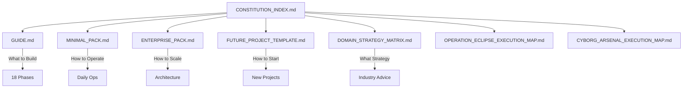

# فهرس الدستور المتقدم

# 🏛️ CONSTITUTION INDEX: Master Document Linking Map
## فهرس الدستور: خريطة الربط الرئيسية

**Purpose:** Navigate the entire documentation system for any project.

---

## 📚 Document Hierarchy



---

## 📋 Quick Reference Table

| Document | Purpose | When to Use |
|---|---|---|
| [GUIDE.md](file:///C:/Users/acer/.gemini/antigravity/brain/596ddf4f-ed45-46e3-8f70-9a9a74633cc3/GUIDE.md) | 18-Phase Master Plan | Project planning & execution |
| [MINIMAL_PACK.md](file:///C:/Users/acer/.gemini/antigravity/brain/596ddf4f-ed45-46e3-8f70-9a9a74633cc3/MINIMAL_PACK.md) | Operations & Runbooks | Daily development |
| [ENTERPRISE_PACK.md](file:///C:/Users/acer/.gemini/antigravity/brain/596ddf4f-ed45-46e3-8f70-9a9a74633cc3/ENTERPRISE_PACK.md) | Architecture & Scaling | Team onboarding |
| [FUTURE_PROJECT_TEMPLATE.md](file:///C:/Users/acer/.gemini/antigravity/brain/596ddf4f-ed45-46e3-8f70-9a9a74633cc3/FUTURE_PROJECT_TEMPLATE.md) | Project Scaffold | Starting new projects |
| [DOMAIN_STRATEGY_MATRIX.md](file:///C:/Users/acer/.gemini/antigravity/brain/596ddf4f-ed45-46e3-8f70-9a9a74633cc3/DOMAIN_STRATEGY_MATRIX.md) | Industry Intelligence | Client discovery |
| [CYBORG_ARSENAL_EXECUTION_MAP.md](file:///C:/Users/acer/.gemini/antigravity/brain/596ddf4f-ed45-46e3-8f70-9a9a74633cc3/CYBORG_ARSENAL_EXECUTION_MAP.md) | Zero-Cost Features | Feature enhancement |
| [OPERATION_ECLIPSE_EXECUTION_MAP.md](file:///C:/Users/acer/.gemini/antigravity/brain/596ddf4f-ed45-46e3-8f70-9a9a74633cc3/OPERATION_ECLIPSE_EXECUTION_MAP.md) | Competitive Strategy | Market positioning |

---

## 🚀 How to Use for a NEW Project

### Step 1: Discovery (30 mins)
1. Open **DOMAIN_STRATEGY_MATRIX.md**
2. Identify client's industry
3. Extract psychological triggers & key features

### Step 2: Planning (1 hour)
1. Open **FUTURE_PROJECT_TEMPLATE.md**
2. Copy the "Core Prompt" to your AI
3. Initialize project structure

### Step 3: Execution (Per Phase)
1. Open **GUIDE.md**
2. Follow phases 1-18 sequentially
3. Use **MINIMAL_PACK.md** prompts as needed

### Step 4: Enhancement (Optional)
1. Apply **OPERATION_ECLIPSE** for strategic superiority
2. Apply **CYBORG_ARSENAL** for power features

### Step 5: Operations (Ongoing)
1. Reference **MINIMAL_PACK.md** for runbooks
2. Share **ENTERPRISE_PACK.md** with team members

---

## 🔗 Essential Files in Any Project

```
project/
├── .env                    # Secrets (never commit)
├── .gitignore              # Exclude .env, node_modules
├── netlify.toml            # Deployment config
├── drizzle.config.ts       # Database config
├── src/
│   ├── app/layout.tsx      # Root + Cyborg components
│   ├── middleware.ts       # Auth protection
│   └── lib/db/schema.ts    # Database schema
└── .github/
    └── workflows/deploy.yml # CI/CD pipeline
```

---

## ⚡ One-Command Project Start

```bash
# 1. Copy this to your AI:
"Initialize a WATMEDIA Supreme Standard project per FUTURE_PROJECT_TEMPLATE.md"

# 2. Then run:
npm install
cp .env.example .env
npx drizzle-kit push
npm run dev
```

---

## 📊 Document Versions

| Document | Version | Last Updated |
|---|---|---|
| GUIDE.md | 2.0 | Jan 2026 |
| MINIMAL_PACK.md | 2.0 | Jan 2026 |
| ENTERPRISE_PACK.md | 2.0 | Jan 2026 |
| FUTURE_PROJECT_TEMPLATE.md | 1.0 | Jan 2026 |
| DOMAIN_STRATEGY_MATRIX.md | 1.0 | Jan 2026 |
| CYBORG_ARSENAL_EXECUTION_MAP.md | 1.0 | Jan 2026 |
| OPERATION_ECLIPSE_EXECUTION_MAP.md | 1.0 | Jan 2026 |

---

**Signed:** The Senate Council | **Standard:** FAANG-Tier Supreme

