```mermaid
graph LR
    subgraph "Foundation"
        P1[1. Setup] --> P2[2. Database]
        P2 --> P3[3. Auth]
        P3 --> P4[4. Layouts]
    end
    subgraph "Features"
        P5[5. Marketing] --> P6[6. Content]
        P6 --> P7[7. Dashboard]
        P7 --> P8[8. Data]
    end
    subgraph "Polish"
        P9[9. Forms] --> P10[10. UI System]
        P10 --> P11[11. Analytics]
        P11 --> P12[12. Testing]
    end
    subgraph "Production"
        P13[13. Security] --> P14[14. Deploy]
        P14 --> P15[15. Admin]
        P15 --> P16[16. Final]
    end
    subgraph "Supreme"
        P17[17. Eclipse] --> P18[18. Cyborg]
    end
    P4 --> P5
    P8 --> P9
    P12 --> P13
    P16 --> P17
```

# دليل الدستور المتقدم

# 📜 WATMEDIA Constitution: The Ultimate 18-Phase Execution Master Plan
## دستور وات ميديا: الخطة الرئيسية للتنفيذ (18 مرحلة)

**Version:** 2.0 (Cyborg Era) | **Date:** Jan 2026
**Architect:** Antigravity (Senate Council) | **Standard:** FAANG-Tier / Supreme

---

## 🗺️ Phase Overview Map



---

## Phase 1-16: Core Development
> *See original constitution for detailed phases 1-16*

| Phase | Name | Key Deliverables |
|---|---|---|
| 1 | Foundation | Next.js 16, Tailwind v4, TypeScript |
| 2 | Database | Neon Postgres, Drizzle ORM |
| 3 | Auth | Clerk, Middleware Protection |
| 4 | Layouts | Root Layout, Dashboard Layout |
| 5 | Marketing | Hero, Services, Portfolio |
| 6 | Content | Service Detail Pages, SEO |
| 7 | Dashboard | Stats Grid, Activity Feed |
| 8 | Data | Live DB Integration |
| 9 | Forms | Contact Form, Zod, Sonner |
| 10 | UI System | Radix Primitives, Components |
| 11 | Analytics | Vercel Analytics, Images |
| 12 | Testing | Vitest, Playwright |
| 13 | Security | Sentry, Rate Limiting |
| 14 | Deploy | GitHub Actions, Edge |
| 15 | Admin | Command Center, Invoices |
| 16 | Final | JSON-LD, Audit, Docs |

---

## Phase 17: Operation Eclipse (التفوق الاستراتيجي) 🌑

**Strategy:** Implement psychological triggers and exclusive features to dominate competitors.

### Components:
| Component | Purpose | File |
|---|---|---|
| **StatusPulse** | Scarcity indicator (breathing animation) | [src/components/layout/StatusPulse.tsx](file:///c:/watmedia-website/watmedia-platform/src/components/layout/StatusPulse.tsx) |
| **CrystalConcierge** | Premium floating contact FAB | [src/components/layout/CrystalConcierge.tsx](file:///c:/watmedia-website/watmedia-platform/src/components/layout/CrystalConcierge.tsx) |
| **EcosystemSection** | Platform positioning narrative | [src/components/home/EcosystemSection.tsx](file:///c:/watmedia-website/watmedia-platform/src/components/home/EcosystemSection.tsx) |

### Meta-Prompt:
```markdown
"Act as a Growth Engineer. Implement 'StatusPulse' using Framer Motion 
to create a breathing animation showing limited availability. Add 
'CrystalConcierge' as a floating button that expands into a glassmorphic 
menu with WhatsApp, Calendar, and Email options."
```

---

## Phase 18: Cyborg Arsenal (الترسانة السايبورغية) 🦾

**Strategy:** Zero-cost power features that transform the site into a premium experience.

### Components Matrix:

| Layer | Component | Purpose | File |
|---|---|---|---|
| **Foundation** | PWA Manifest | Installable app | [src/app/manifest.ts](file:///c:/watmedia-website/watmedia-platform/src/app/manifest.ts) |
| | ScrollProgress | Reading progress bar | [src/components/layout/ScrollProgress.tsx](file:///c:/watmedia-website/watmedia-platform/src/components/layout/ScrollProgress.tsx) |
| | BackToTop | Floating return button | [src/components/layout/BackToTop.tsx](file:///c:/watmedia-website/watmedia-platform/src/components/layout/BackToTop.tsx) |
| **UX Polish** | CopyButton | One-click copy | [src/components/ui/CopyButton.tsx](file:///c:/watmedia-website/watmedia-platform/src/components/ui/CopyButton.tsx) |
| | ShareButton | Native share API | [src/components/ui/ShareButton.tsx](file:///c:/watmedia-website/watmedia-platform/src/components/ui/ShareButton.tsx) |
| | ReadingTime | Time estimate | [src/lib/readingTime.ts](file:///c:/watmedia-website/watmedia-platform/src/lib/readingTime.ts) |
| **Power User** | CommandPalette | CMD+K navigation | [src/components/layout/CommandPalette.tsx](file:///c:/watmedia-website/watmedia-platform/src/components/layout/CommandPalette.tsx) |
| | KeyboardShortcuts | G+H, G+D shortcuts | [src/hooks/useKeyboardShortcuts.ts](file:///c:/watmedia-website/watmedia-platform/src/hooks/useKeyboardShortcuts.ts) |
| **Delight** | Confetti | Celebration effect | [src/lib/confetti.ts](file:///c:/watmedia-website/watmedia-platform/src/lib/confetti.ts) |
| | AnimatedCounter | Number animation | [src/components/ui/AnimatedCounter.tsx](file:///c:/watmedia-website/watmedia-platform/src/components/ui/AnimatedCounter.tsx) |
| | EasterEgg | Konami Code secret | [src/hooks/useKonamiCode.ts](file:///c:/watmedia-website/watmedia-platform/src/hooks/useKonamiCode.ts) |

### Meta-Prompt:
```markdown
"Act as a UX Engineer. Implement the Cyborg Arsenal: 
1. PWA manifest for installability
2. CMD+K Command Palette using 'cmdk' package
3. Confetti celebration on form success using 'canvas-confetti'
4. Animated counters that trigger when scrolled into view
5. Konami Code Easter Egg (↑↑↓↓←→←→BA)"
```

---

## 🔗 Required Dependencies (2026 Stack)

```bash
# Core
next@16 react@19 typescript tailwindcss@4

# Database & Auth
drizzle-orm @neondatabase/serverless @clerk/nextjs

# UI & Animation
framer-motion lucide-react @radix-ui/react-slot 
@radix-ui/react-dialog @radix-ui/react-select
class-variance-authority clsx tailwind-merge

# Cyborg Arsenal
cmdk canvas-confetti

# Utilities
zod sonner date-fns

# Quality
vitest playwright @sentry/nextjs @upstash/ratelimit
```

---

## 📁 Golden File Structure

```
src/
├── app/
│   ├── manifest.ts          # PWA
│   ├── layout.tsx           # Root + Cyborg Components
│   ├── page.tsx             # Landing
│   ├── (auth)/              # Sign-in/up
│   ├── (dashboard)/         # Protected area
│   └── admin/               # Admin console
├── components/
│   ├── ui/                  # Atoms
│   ├── layout/              # Layout components + Cyborg
│   ├── home/                # Homepage sections
│   └── business/            # Domain-specific
├── hooks/
│   ├── useKeyboardShortcuts.ts
│   └── useKonamiCode.ts
├── lib/
│   ├── db/                  # Drizzle
│   ├── confetti.ts
│   ├── readingTime.ts
│   └── utils.ts
└── middleware.ts            # Auth protection
```

---

## ✅ Universal Checklist

### Pre-Launch:
- [ ] `.env` secured (not in git)
- [ ] Database schema pushed
- [ ] Middleware protecting routes
- [ ] CI/CD pipeline passing

### Post-Launch:
- [ ] Sentry receiving errors
- [ ] Analytics tracking
- [ ] PWA installable
- [ ] CMD+K working

---

**Signed:** The Senate Council | **Date:** 18 Jan 2026

